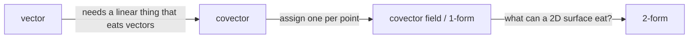

# `/understand` — Design

Status: approved 2026-08-18. Implementation plan not yet written.

A personalized teaching system for Claude Code: **Probe → Plan → Teach**, driven by an
explicit learning doctrine, with a persistent per-domain model of what the learner
already understands.

Distinct from the existing skills in this setup:

| Skill | Role |
|---|---|
| `mentor` | Socratic guidance inside a concrete problem the user is stuck on *right now*. Ephemeral. |
| `teach` | Multi-session curriculum producing standalone HTML lessons + reference docs. |
| `understand` | Builds *structure*: locates the learner's edge, plans a motivated derivation path, walks it one reasoning step at a time, harvests the compression. |
| `anki-flashcards` | Spaced retention. Receives only genuinely arbitrary items from `understand`. |

`teach` is left untouched. Whether the two merge is a later decision, taken after
`understand` has been used for real sessions.

---

## 1. Doctrine

The system exists to serve six rules. They are the user's stated learning philosophy,
not generic pedagogy, and they live in `DOCTRINE.md` so they can be tuned without
touching machinery.

1. **Unconditional truths first.** The brain will not commit to a fact that a later,
   more fundamental fact could tear out — so it hedges and half-holds. The fix is to
   start from facts that *cannot* be contradicted: universal statements (`all X are Y`,
   `no X is Y`) and real definitions — not vague lists of properties. Foundations come
   first not for tidiness but because they are **cheap to accept**.
2. **Motivated discovery.** An arbitrary fact is the hardest kind to hold. Every step
   must answer: what problem sends us here, and why would anyone try this particular
   move? The learner re-derives rather than receives.
3. **Understanding is structure over facts.** Brain A holds the propositions that answer
   the questions. Brain B holds fewer, more fundamental truths plus deduction. Identical
   under test, different in kind. Understanding is the **edges**.
4. **The click is compression.** A pile of lonely facts refactors into a few generating
   ideas. Learning grows what the structure covers; understanding shrinks what must be
   held to regenerate it.
5. **Work at the edge.** A new node locks in only if there is something to attach it to.
   Past the edge, nothing attaches. Behind it, nothing is added.
6. **Structure is durable.** Wired knowledge regenerates from its neighbours. Memorized
   facts simply vanish when forgotten.

## 2. Doctrine → mechanics

Every mechanism below traces to a rule. Nothing is in the system for its own sake.

| Rule | Mechanism |
|---|---|
| 5 | **Probe.** The edge cannot be taught to until it is located. Binary-search every dependency strand of the goal. |
| 1 | Probe also identifies *which unconditional truths the learner already accepts*. The plan roots there, not in generic axioms. |
| 2, 3 | **Plan DAG.** The graph *is* the edge structure. Every edge is labelled with its **motivation** — the problem at the tail that sends you to the head. Emitting the graph forces the reasoning to be done before teaching begins; the model cannot wing it. |
| 2 | **Step contract.** Tension → motivated move → object → anchor. |
| 4 | **Compression checkpoints.** Periodically collapse the walked strand into its generator set and write it to a reference note that is *shorter* than the log. |
| 3 | **Understanding map** stores generators and edges, Brain-B shaped — never a topic checklist. |
| 1, 6 | **Convention quarantine.** Facts that genuinely cannot be motivated (notation, names, historical accident) are tagged, never fake-derived, and routed to Anki. Everything else is expected to be regenerable and needs no drilling. |

Three deliberate improvements over the reference implementation that inspired this design:

- **Compression is harvested.** The reference walks the DAG forward and stops; rule 4 is
  the payoff and never gets collected.
- **Edges carry motivations**, not just dependency order.
- **Arbitrary facts are triaged** rather than treated like derivable ones.

## 3. Architecture

```
~/.claude/skills/understand/
  SKILL.md          orchestrator + phase machine
  DOCTRINE.md       the six rules, user-editable
  PROBE.md          binary-search protocol, question construction rules
  PLAN.md           DAG construction rules + mermaid emission format
  TEACH.md          step contract, quiz gating, compression checkpoints
  FORMATS.md        map / log / reference note schemas
  DESIGN.md         this document

~/.claude/agents/
  svg-illustrator.md      authors an SVG, views it, self-corrects
  learning-verifier.md    domain-gated verification
```

`SKILL.md` carries `disable-model-invocation: true`. The skill fires only on explicit
`/understand`, never on a casual "help me understand X".

**Model.** Teaching quality tracks model intelligence, so both subagents declare
`model: opus` in frontmatter. Reasoning effort is not an agent-frontmatter field — it is
a session-level setting inherited by subagents, so `SKILL.md` states that the skill
expects an Opus-class model at **high** reasoning effort and warns if it looks otherwise.

**No plugin.** Packaging is deferred until the skill has proven itself. The two
user-level agents are the only shared-namespace footprint.

## 4. Phase machine

### Phase 0 — Bind

- Read `DOCTRINE.md`.
- Resolve the domain from the request; read `<VAULT_ROOT>/Learning/<domain>/_map.md` if present.
- Create the live log, print its path. **The Obsidian note is the interface** — LaTeX,
  mermaid and embedded SVG render there and cannot render in a terminal.
- If the goal is vague, ask exactly one question: target understanding, and why it
  matters. An ungrounded goal produces abstract lessons and gives no basis for choosing
  what comes next.

### Phase 1 — Probe

Purpose: locate the edge on every strand the goal depends on (rule 5), and find the
already-accepted unconditional truths to root the plan in (rule 1).

Probe must produce a strong picture of where the learner stands and where to start —
**fast**. A ceiling of 20 questions is not a target of 20 questions. Five mechanisms keep
it short without weakening the map:

1. **Self-report opens the phase.** One free-text question: what do you already know here,
   and what have you already worked with? A self-report cannot enter the map — the Brain-A
   illusion makes it unreliable as evidence — but it is excellent at setting the
   **starting altitude** of each binary search. Trust it to aim, never to conclude. (The
   reference implementation's long probe was explicitly the consequence of giving it
   almost no starting context.)
2. **One question per message. Never batch.** Each answer changes which question is worth
   asking next — that is the whole point of a binary search, and batching throws the
   information away. Speed comes from asking *fewer, better-placed* questions, not from
   asking several at once.
3. **Start high, bisect down.** The first question on a strand sits high in it, not at its
   base. A correct answer eliminates the whole strand below in one move.
4. **Propagate inference.** When a correct answer to a high question logically entails the
   prerequisites beneath it, mark those `inferred-locked` and do not test them. Only
   test-confirm an inferred item when a plan root depends on it directly. Doctrine-
   consistent: if the learner holds the generator, they hold what it generates (rules 3, 6).
5. **Spend by proximity to the goal.** Strands adjacent to the goal get bisected properly.
   Distant strands get one question each — enough to confirm the ground is solid, not
   enough to map it.

Then:

- Back-chain from the goal to a provisional strand list. Do not show it yet.
- Skip items the map records as locked and fresh. Re-test stale locked items only when the
  goal directly depends on them.
- Check other domains' maps for transferable locked items before probing them again.
- Stop a strand as soon as the edge is bracketed to within one step. Certainty is not the
  goal; a correct *starting point* is.

Question construction:

- Use `AskUserQuestion`. **Always include an explicit "I don't know" option** — a guess
  poisons the map, and an honest unknown is the highest-signal answer available.
- Options of equal length. No formatting, length or specificity tells.
- Test structure, not recall. A Brain-A answer must not pass: prefer "what does this
  compute", "why must this hold" over "what is the formula for".
- Reveal the correct answer only when the user answers "I don't know" — it is free
  teaching and a warm-up, and costs nothing since no signal is being extracted.

Budget: **20 questions is a hard ceiling, ~10 is the target.** Announce the ceiling at the
start. If the ceiling is reached with an edge still unlocated, stop and say
which strand is unresolved — then start teaching at the lowest confirmed point rather than
guessing. Never spend the ceiling on precision the plan does not need.

Grade silently. Write the map at the end of the phase, in one pass — never leave a
half-written map.

### Phase 2 — Plan

1. Spawn `learning-verifier` — **non-blocking**. Domain-gated:
   - formal domains (mathematics, logic, type theory): internal-consistency check on the
     planned claim set, no web search
   - empirical or fast-moving domains (libraries, APIs, hardware, physics constants,
     history): real source verification via Context7/WebSearch, citations returned
2. Build the DAG:
   - **roots** = unconditional truths the learner already accepts
   - **nodes** = one reasoning step each, sized to working memory
   - **edges** labelled with the motivation that traverses them
   - each node tagged `derive` or `convention`
3. Emit mermaid to the live log and present it. The user may prune branches they already
   own or reorder priorities.
4. Merge verifier findings before teaching starts. A contradicted claim blocks its node.

### Phase 3 — Teach

One node per message, in DAG order. Per node:

1. **Tension** — the problem the current frontier cannot solve.
2. **Motivated move** — why anyone would try this particular thing.
3. **The object** — the minimal fix, stated as a real definition.
4. **Anchor** — one line, universal form where possible, safe to accept at face value.
5. **Reframe** — name explicitly what already-known thing this recasts. Relabelling
   existing structure is the cheapest learning available.
6. **Visual** — spawn `svg-illustrator` when the content is genuinely geometric.
   Non-blocking.
7. **Quiz gate** — one or two questions on *this step only*. Wrong → re-teach by a
   different route, do not advance. Never advance past an unverified step.

Append each step to the live log as it is produced.

Never batch steps. Never look ahead. User questions mid-step are the expected mode of
operation, not an interruption.

### Compression checkpoint

At each strand end, or roughly every four nodes:

- Ask what the strand collapsed into. Which nodes are generators, which are now
  derivable from them?
- Write/update the reference note: generators, labelled edges, anchors. It must be
  **shorter than the log**.
- Update `_map.md`, including its accumulated structure graph.
- Route `convention` nodes to Anki drafts.

### Session close

Map updated with locked/shaky/frontier and dates. Reference note updated. Log closed
with an explicit next-frontier line so the following session reaches Phase 2 quickly.

## 5. Artifacts

```
<VAULT_ROOT>/Learning/<domain>/
  _map.md                     understanding model + accumulated structure graph
  logs/YYYY-MM-DD-<topic>.md  live transcript: steps, quizzes, answers, visuals
  reference/<concept>.md       generators + labelled edges + anchors
  assets/*.svg                 embedded into notes via ![[...]]
```

Two files per session by design: the log is the reading surface during the session and
will rarely be reopened; the reference note is the compressed artifact that will be.

### `_map.md`

````markdown
---
domain: differential-geometry
updated: 2026-08-18
---

## Locked
- line integral computes work done along a path — probe q3 correct — 2026-08-18
- divergence is outward flux per unit volume — probe q4 correct — 2026-08-18
- dot product as projection — inferred-locked from q3 — 2026-08-18

## Shaky
- E and B mix under boost — answered "don't know", taught in session — 2026-08-18

## Unknown
- generalized Stokes
- pullback

## Conventions (routed to Anki)
- wedge symbol ordering convention — 2026-08-18

## Structure

````

The structure graph accumulates across every session in the domain — a growing picture
of the user's actual understanding.

### `logs/*.md`

Frontmatter (`domain`, `topic`, `date`, `goal`), then append-only: probe questions with
answers and grades, the plan graph, each teaching step verbatim, quiz results, embedded
visuals, warning callouts for any failure.

### `reference/*.md`

Frontmatter, then: `## Generators` (the unconditional truths this concept rests on),
`## Edges` (motivation-labelled, as mermaid), `## Anchors` (the one-liners),
`## Sources` (citations when the verifier produced them). No narration.

## 6. Subagents

**`svg-illustrator`** — `model: opus`. Receives the concept, the anchor, and the target
file path. Authors an SVG, reads it back as an image, corrects it, returns the path.
Tools: Read, Write, Edit, Bash.

**`learning-verifier`** — `model: opus`. Receives the planned claim set and the domain
classification. Returns per-claim verdicts and, for empirical domains, citations. Tools:
Read, WebSearch, WebFetch — plus the Context7 MCP tools when that server is connected in
the session, since it is not guaranteed to be available. WebFetch is the fallback for
documentation lookups, never parametric recall.

## 7. Failure handling

No silent fallbacks.

- **Illustrator dies** (the reference implementation lost one mid-session to an
  Overloaded error): write a visible `> [!warning] visual pending` callout into the note,
  continue teaching text-only, retry once at the next checkpoint. Teaching never blocks
  on a subagent.
- **Verifier contradicts a claim**: stop, surface the contradiction, re-plan the affected
  node. Never teach a contradicted claim, and never quietly drop it.
- **Three "I don't know" answers in one strand**: the edge is below where it was assumed
  to be. Back up the DAG rather than pushing forward.
- **Vault path missing**: create `<VAULT_ROOT>/Learning/` and its subfolders (approved). If the
  vault root itself is absent, fail loudly — never invent a path.
- **Quiz failed twice on one node**: the explanation route is wrong, not the learner.
  Change approach — different motivation, different anchor, add a visual — and record the
  failed route in the log.

## 8. Out of scope

Deliberately excluded, to be revisited only on evidence of need:

- plugin packaging
- HTML lesson generation (that is `teach`'s job)
- writing to Anki directly (hand off to `anki-flashcards`)
- a spaced-repetition scheduler
- cross-domain map linking
- rewriting or merging `teach`

## 9. Acceptance test

A skill cannot be unit-tested; verification is one real session, checked against:

1. `_map.md` exists afterwards with graded items and dates, including any
   `inferred-locked` entries
2. probe reached a start point in **≤20 questions, asked one at a time**, and teaching
   began from a point the learner confirms is correctly placed
2. every DAG edge in the emitted mermaid carries a motivation label
3. the quiz gate demonstrably blocks advancement on a wrong answer
4. the log renders LaTeX, mermaid and embedded SVG correctly in Obsidian
5. the reference note is shorter than the log and contains no narration
6. at least one `convention` item reaches `<VAULT_ROOT>/Anki Drafts/`
7. a deliberately killed illustrator produces a warning callout and does not stall the
   session

## 10. Decisions taken

| Decision | Choice |
|---|---|
| Relationship to `teach` | New skill; `teach` untouched, revisit later |
| Cross-session memory | Persistent per-domain understanding map |
| Teaching philosophy | The six doctrine rules above, in an editable `DOCTRINE.md` |
| Name | `understand`, model-invocation disabled |
| Probe budget | 20 questions hard ceiling, ~10 targeted; strictly one question per message, inference-propagating, self-report-primed |
| Verification | Domain-gated, non-blocking, citations for empirical domains |
| Visuals | Full SVG subagent pipeline with self-review, non-blocking |
| Note output | Two files: live log + distilled reference |
| Vault location | New `<VAULT_ROOT>/Learning/<domain>/` |
| Model | Opus, high reasoning effort |
| Packaging | Plain user-level skill + two user-level agents |
