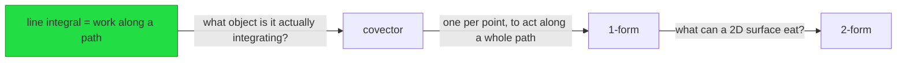
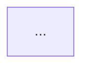
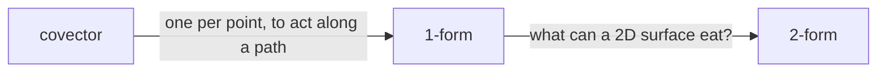

# File formats

Vault root: `<VAULT_ROOT>` — set this before first use; see the repo README.
All paths below are relative to `<VAULT_ROOT>/Learning/`.

```
<domain>/
  _map.md
  logs/YYYY-MM-DD-<topic>.md
  reference/<concept>.md
  assets/<nn>-<slug>.svg
```

`<domain>` is a stable kebab-case field name — `differential-geometry`, `rust-ownership`,
`ldap`. Never the session topic. Reuse an existing domain folder whenever the topic fits.

---

## `_map.md` — the understanding model

One per domain. Written in a **single pass** at the end of each phase that changes it. This is
the file that makes every session after the first one short, so it must never be left
half-written.

Every item carries **claim — evidence — date**. Evidence is one of:
`probe qN correct` · `probe qN wrong` · `answered don't know` · `inferred-locked from qN` ·
`self-reported, untested` · `taught <date>` · `quiz gate passed` · `user asserted`

````markdown
---
domain: differential-geometry
updated: 2026-08-18
sessions: 1
---

# Understanding map — differential geometry

## Locked
Solid ground. Safe to build on without re-testing.

- line integral computes work done along a path — probe q3 correct — 2026-08-18
- divergence is outward flux per unit volume — probe q4 correct — 2026-08-18
- dot product as projection — inferred-locked from q3 — 2026-08-18
- covector = linear map from vectors to numbers — quiz gate passed — 2026-08-18

## Shaky
Held, but not reliably. Repair on the way past; do not root a plan here.

- E and B mix under a boost — answered don't know, taught in session — 2026-08-18

## Unknown
Not yet reached. Not evidence of difficulty, only of order.

- generalized Stokes
- pullback
- exterior derivative

## Conventions
Genuinely arbitrary. Never derived. Queued for spaced repetition.

- wedge symbol ordering convention — queued to Anki Drafts — 2026-08-18

## Structure
Accumulates across every session in this domain. Edge labels are the motivations actually
taught — this graph is the picture of the understanding, not a syllabus.



## Next frontier
- resume at: wedge product — construction from antisymmetrisation
````

---

## `logs/YYYY-MM-DD-<topic>.md` — live session log

Append-only, written **as the session happens**. This is the user's reading surface: LaTeX,
mermaid, callouts and embedded SVG render here and cannot render in a terminal. Print its
path at the start of the session.

Rarely reopened afterwards — that is what the reference note is for. So completeness beats
polish here. Presentation still matters, because the user reads this note *while* thinking:
the step structure has to be visible at a glance, not parsed out of a paragraph.

### Callout vocabulary

Each part of the step contract has one fixed callout type. Never improvise a mapping — the
colours are how the user navigates the note.

| Part | Callout |
|---|---|
| session goal | `> [!tldr] Goal` |
| whole probe transcript | `> [!example]- Probe — <n> questions` (collapsed) |
| verifier outcome | `> [!info] Verification` |
| tension | `> [!failure] Tension` |
| motivated move | **prose, not boxed** |
| the object | `> [!abstract] Definition` |
| anchor | `> [!important] Anchor` |
| reframe | `> [!note] Reframe` |
| quiz question | `> [!question] Quiz` |
| grade | `> [!success] Quiz — correct` / `> [!failure] Quiz — missed` |
| subagent failure | `> [!warning] visual pending — <concept>` |
| user's own compression | `> [!quote] Your compression` |
| your compression | `> [!summary] Reconciled` |

**Box discipline.** At most ~3 callouts per node, prose in between. A note where every block
is boxed reads as a wall of boxes and nothing stands out — which defeats the point of boxing
the tension, the anchor and the quiz. The motivated move is deliberately unboxed: it is the
argument, and it should read as continuous reasoning.

**Mermaid stays outside callouts** — it does not reliably render inside one. Math does, in
both `$…$` and `$$…$$`.

````markdown
---
domain: differential-geometry
topic: introduction to differential forms
date: 2026-08-18
goal: express Maxwell's equations in two equations using forms
status: in-progress
---

# Understanding differential forms

> [!tldr] Goal
> <the user's own words, verbatim from Phase 0>

## Probe

> [!example]- Probe — 12 questions, edge located
> **Self-report.** <verbatim>
>
> **q1** A force field acts on a particle moving along a curve $C$. What does the line
> integral compute? → *net work done by the field* — correct
> **q2** …

**Edge located.** Vector calculus solid, differential-forms language absent, special
relativity shaky.
**Roots.** line integral as work; divergence as flux density.

## Plan



> [!info] Verification
> Formal domain — internal-consistency pass, no contradictions.

## Teaching

### Node 1 — covectors

> [!failure] Tension
> We have something that eats one vector and returns a number. But a surface has two
> directions, and nothing we hold can take two vectors at once.

So try the cheapest possible extension: a machine that eats two vectors and is linear in
each. <the motivated move, in prose — this is the argument, so it stays unboxed>

> [!abstract] Definition
> A covector on $V$ is a linear map $\alpha: V \to \mathbb{R}$.

![[01-covector-eats-vector.svg]]

> [!important] Anchor
> A $k$-form is the kind of thing a $k$-dimensional surface can eat.

> [!note] Reframe
> $dx$ was never an infinitesimal. It is the covector that reads off the $x$-component of
> whatever vector you feed it — every line integral you already know still stands.

> [!question] Quiz
> $\alpha = 3\,dx - 2\,dy$ and $v = (2,5)$. What is $\alpha(v)$, and why did you not need a
> metric to compute it?

> [!success] Quiz — correct
> **Answer.** $-4$ — "the form already carries the coefficients"
> **Reasoning.** sound; did not reach for a dot product.

### Node 2 — …

> [!warning] visual pending — 2-form as oriented area
> illustrator returned an error; retry at next checkpoint

## Compression checkpoint 1

> [!quote] Your compression
> <verbatim — this is the measurement>

> [!summary] Reconciled
> generators: …; missing edge found at: …

## Next frontier
resume at: wedge product — construction from antisymmetrisation
````

---

## `reference/<concept>.md` — the compressed artifact

Written and updated at compression checkpoints. **Must be shorter than the log.** If it is
not, no compression happened.

No narration, no teaching voice, no transcript. This is the file that gets reopened.

````markdown
---
domain: differential-geometry
concept: forms as things surfaces eat
updated: 2026-08-18
generators: 3
---

# Forms as things surfaces eat

## Generators
The whole strand regenerates from these.

1. A covector is a linear map from vectors to numbers.
2. A `k`-form is the kind of thing a `k`-dimensional surface can eat.
3. Integration over a `k`-dimensional region is integration of a `k`-form.

## Edges


## Anchors
- $dx$ is not an infinitesimal — it is the covector reading off the $x$-component.
- All integration over a 1-dimensional thing is integration of a 1-form.

## Conventions
- wedge ordering — a choice, not a consequence

## Sources
- <citation> — only when the verifier produced them
````

---

## Anki drafts

Conventions and hard-clicked insights go to
`<VAULT_ROOT>/Anki Drafts/YYYY-MM-DD-<topic>.md`, in the format the `anki-flashcards` skill
already reads. Match the existing files exactly — frontmatter with
`session` / `session_path` / `status: draft` / `created` / `scout_mode`, then one `## Card N`
section per card with `type`, `deck`, `tags`, `status`, and `**Front**` / `**Back**` /
`**Elaboration**` blocks.

Set `status: draft`. `/anki import` handles the rest. Never write to Anki directly from this
skill.
