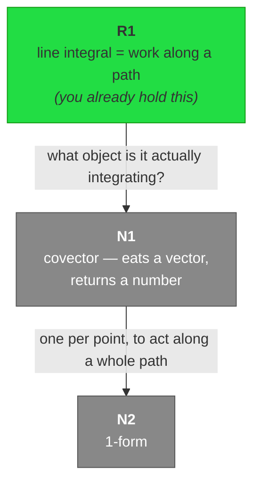

# Phase 2 — Plan

**Purpose.** Reason out the entire path from the user's measured edge to the goal, *before*
teaching anything. The DAG you emit is not decoration — it is the commitment that stops you
winging the arc mid-lesson, and it is literally the edge structure that doctrine rule 3 calls
understanding.

## Step 1 — Fire verification (non-blocking)

Classify the domain, then spawn the `learning-verifier` subagent. **Do not block on it.**
Continue building the plan; merge its findings before Phase 3 begins.

**Formal domains** — mathematics, logic, type theory, pure algorithms. Nothing external to
check against, so ask for an **internal-consistency pass**: are the claims mutually
consistent, are the definitions actually definitions rather than property lists, does each
stated derivation follow. No web search.

**Empirical or fast-moving domains** — libraries, APIs, language semantics, hardware,
physics constants, standards, history. Parametric memory is not acceptable here. Ask for
**real source verification with citations**, via Context7 when connected, WebFetch/WebSearch
otherwise.

Mixed topics get both, scoped per claim.

Pass the verifier the *claim set* you intend to teach — one line per claim — plus the domain
classification. Not the whole plan.

## Step 2 — Choose the roots

**Roots are the unconditional truths the user already accepts** (doctrine rule 1), taken from
the probe and the map. Not generic axioms of the field, and not where a textbook would start.

A root must be something they can accept with no caveats: a universal statement, or a real
definition. If a candidate root still feels conditional to them, it is not a root — descend
until you find one that is.

## Step 3 — Build the DAG

**Nodes.** One reasoning step each. Sized to working memory — if a node needs two new objects
to make sense, it is two nodes. A node that cannot be quizzed in one question is too big.

**Edges carry motivations.** This is the part that matters. Each edge is labelled with the
*problem at its tail that sends you to its head*: what the previous step cannot do. Not
"prerequisite of", not topic order.

Good: `covector --"one per point, so it can act along a whole path"--> 1-form`
Bad: `covector --> 1-form`

If you cannot state an edge's motivation, you do not yet understand the path and must not
start teaching it. Find the motivation or restructure.

**Tag every node.**

- `derive` — the object is the minimal answer to a real problem. Almost everything.
- `convention` — genuinely arbitrary: notation, naming, ordering conventions, historical
  accident. **Never fake-derive a convention** (doctrine rule 1). Tag it, teach it in one
  line as "this is a choice, not a consequence", and queue it for Anki (rule 6).

**Prefer reframes.** When a node recasts something the user already holds — `dx` becoming a
covector, a line integral becoming the integration of a 1-form — mark it as a reframe. These
are the cheapest nodes in the plan: relabelling existing structure rather than building new.
Order the DAG to front-load them where possible.

**Depth.** Plan the whole path to the goal, but expect not to walk all of it in one session.
Mark a realistic session boundary. Do not shorten the plan to fit — shorten the walk.

## Step 4 — Emit and present

Write the mermaid graph into the live log as a **top-to-bottom live status board**, not a
static diagram — this is the current house style, adopted after it was iterated live with
the user; do not revert to the older left-right one-shot version below.

**Layout.** `graph TD`, not `graph LR`. Top-to-bottom avoids the horizontal scrolling a wide
`LR` graph forces in Obsidian's note pane. Attach each root directly above the single node
that consumes it (not all pooled at the top) — this keeps merges to 2–3 parents and avoids
the overlapping-node rendering Obsidian produces when too many edges converge from the side.

**Node labels** carry their own id in bold, plus the plain-language phrase — never the bare
term alone (doctrine rule 7): `"<b>N1</b><br/>covector — eats a vector, returns a number"`.
The id lets the user talk about "N3" in chat and have it mean something visually.

(A top-left-corner-tag variant using an HTML `<table>` inside the label was tried live and
rejected — it rendered inconsistently and looked worse than plain bold-then-linebreak. Do
not reintroduce it.)

**Three-state color, updated live.** Every node gets one of three classes:

- `root` (green, `fill:#2d4,stroke:#191`) — locked before teaching started, from the probe.
  **Never repainted** — this band is the permanent record of where the user began.
- `pending` (grey, `fill:#888,stroke:#555,color:#fff`) — planned, not yet taught.
- `learned` (gold, `fill:#fd4,stroke:#b90`) — taught and quiz-gate passed this session.

At emission time every non-root node is `pending`. Flip a node to `learned` the moment its
quiz gate passes (see TEACH.md step 7) by editing its `:::class` in place in the log — the
graph is a living artifact, not a one-time snapshot.

**Legend.** Directly above the mermaid block, render the three states as colored HTML
badges (Obsidian renders inline HTML in markdown), not a plain-prose sentence — this reads
at a glance the way the graph's colors do:

```html
<span style="display:inline-block;padding:2px 10px;margin-right:6px;border-radius:4px;background:#2d4;color:#111;font-weight:600;">green — root</span>where you started
<span style="display:inline-block;padding:2px 10px;margin:6px 6px 0 0;border-radius:4px;background:#888;color:#fff;font-weight:600;">grey — pending</span>not yet taught
<span style="display:inline-block;padding:2px 10px;margin:6px 6px 0 0;border-radius:4px;background:#fd4;color:#111;font-weight:600;">gold — learned</span>taught and quiz-passed
```

Keep each badge's own text short — no trailing qualifiers like "this session" or "never
repainted" bolted onto the badge's line; the fuller explanation belongs in this file, not in
every session's log.

Example skeleton (a small slice — a real plan has a root feeding each node that needs it):



Mermaid goes into the log **unboxed** — it does not render reliably inside a callout. The
verifier outcome goes directly under it as `> [!info] Verification`.

Then in chat, briefly:

- the roots, named as things they already hold
- the arc in one sentence
- where the session boundary is
- anything the verifier flagged, if it has returned

Ask whether to prune. The user may already own a branch, or want a different order. Honour it
and update both the graph and the map.

## Step 5 — Merge verification, then start

Before the first teaching step:

- **Verifier confirms** → proceed.
- **Verifier contradicts a claim** → stop. Surface the contradiction in chat and in the log.
  Re-plan the affected node. **Never teach a contradicted claim, and never quietly drop it.**
- **Verifier still running** → start teaching only nodes it has already cleared. If it has
  cleared nothing, wait and say you are waiting.
- **Verifier died** → write a `> [!warning] verification failed` callout into the log naming
  the unverified claims, retry once, and if it fails again tell the user which claims are
  unverified so they know what to hold loosely.
